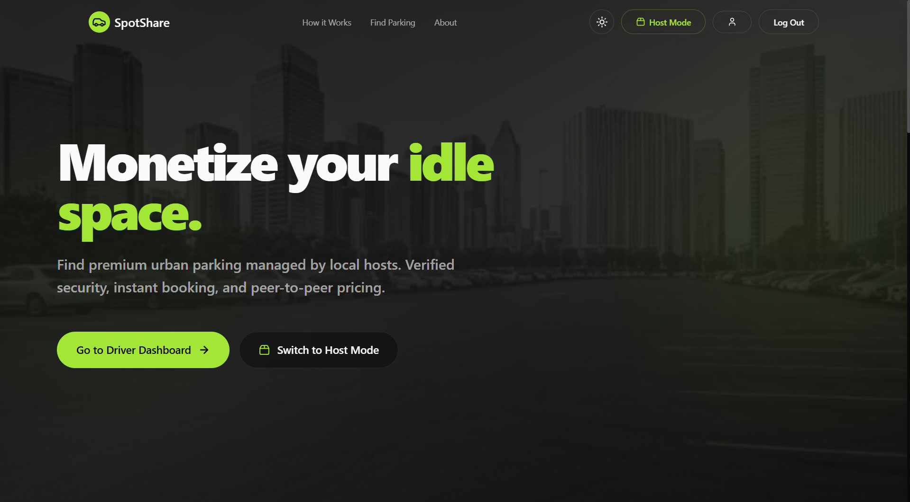
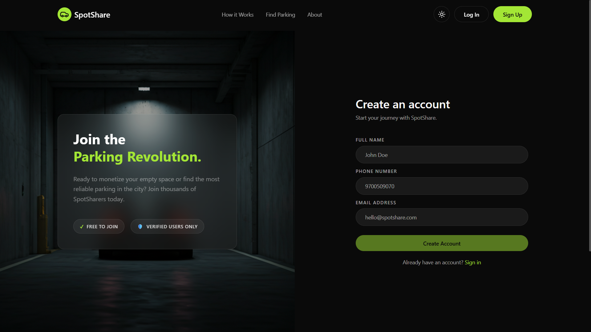

<div align="center">

# 🚗 SpotShare - Peer-to-Peer Parking Platform

**SpotShare** is a full-stack, peer-to-peer parking spot sharing platform built with Django, PostgreSQL, and Leaflet. It connects drivers searching for convenient parking with hosts who have unused spots.

Featuring passwordless OTP authentication, real-time geolocation map search with Haversine distance filtering, a complete booking state machine with OTP-verified arrivals, and asynchronous email notifications powered by Celery + Redis. The UI follows a custom "Lime Glass" glassmorphism design language with dark/light theme-reactive maps.

## 🛠️ Made With


</div>


## 📸 Screenshots

|              **Home Page**               |               **SignUp Page**                |
| :--------------------------------------: | :------------------------------------------: |
|  |  |


<!-- |                  **Host Dashboard**                   |               **Booking Detail (OTP)**                |
|  |  | -->


---

## ✨ Features

### 🔐 Security & Authentication
* **Passwordless OTP Login:** No passwords stored — users authenticate via a 6-digit email OTP stored in Redis with 5-minute TTL.
* **Progressive Rate Limiting:** Escalating cooldowns (30s → 1m → 5m) with a hard cap of 4 OTPs per hour.
* **Brute-Force Lockout:** Account locked for 1 hour after 3 consecutive failed OTP attempts.
* **Role-Based Workflows:** Session-based role switching between Driver and Host from a single account.

### 🏠 Host Operations
* **Spot Wizard:** Multi-step form with Leaflet map picker for GPS pinning, image uploads (1–3), and amenity flags.
* **Availability Scheduling:** Granular day/hour availability matrix with one-click "Set 24/7" shortcut.
* **Dashboard Analytics:** Total earnings, pending earnings, active parkers, and booking history at a glance.
* **Booking Management:** Verify arrivals via OTP, mark no-shows (after 5-min grace), emergency override, and cancel with auto-notifications.
* **Soft Delete:** Deleting a spot with booking history preserves data integrity; upcoming bookings are auto-cancelled with email notifications.

### 🚗 Driver Operations
* **Interactive Map Search:** CARTO theme-reactive tiles with radius filtering, vehicle size, amenity filters, and time-window availability.
* **Haversine Distance Sort:** Results sorted by proximity using the Haversine formula (great-circle distance).
* **Smart Booking Logic:** Prevents double-booking, validates availability schedules, blocks past/self bookings, enforces 1-week advance limit.
* **OTP Reveal Window:** Booking OTP visible only 60 minutes before start until booking end.
* **Trip Management:** Active, Upcoming, and Past trip views with one-tap Google Maps navigation.

---

## 🛠️ Tech Stack

* **Backend:** Python / Django 6.0
* **Database:** PostgreSQL (via `psycopg2`)
* **Cache & Broker:** Redis (OTP storage, rate limiting, Celery message broker)
* **Task Queue:** Celery (async email dispatch with 3 retries)
* **Frontend:** HTML5, Tailwind CSS v4, Vanilla JavaScript
* **Mapping:** Leaflet.js, CARTO Basemaps, Nominatim (OSM geocoding)
* **Animations:** Lenis (smooth scrolling)
* **Auth:** Custom `AbstractBaseUser` + `PasswordlessAuthBackend`

---

## 🗃️ Database Schema

```
┌──────────────────────┐
│       users          │
├──────────────────────┤
│ id (PK)              │
│ email (UQ)           │
│ full_name            │
│ phone                │
│ is_active            │
│ is_staff             │
│ date_joined          │
└──────────┬───────────┘
           │ FK (owner)              FK (driver)
┌──────────┴───────────┐       ┌──────────────────────┐
│    parking_spots     │       │      bookings        │
├──────────────────────┤       ├──────────────────────┤
│ id (PK)              │◄──────│ spot_id (FK)         │
│ owner_id (FK→users)  │       │ driver_id (FK→users) │
│ title                │       │ start_datetime       │
│ description          │       │ end_datetime         │
│ address              │       │ final_price (≥0)     │
│ latitude             │       │ status               │
│ longitude            │       │ otp (4-digit)        │
│ vehicle_size         │       │ otp_verified_at      │
│ base_rate_per_hour   │       │ cancelled_reason     │
│ status               │       │ created_at           │
│ is_deleted           │       └──────────────────────┘
│ is_covered           │
│ has_guard            │       ┌──────────────────────┐
│ has_cctv             │       │    spot_images       │
│ has_ev_charging      │       ├──────────────────────┤
│ instructions         │       │ id (PK)              │
│ created_at           │◄──────│ spot_id (FK)         │
└──────────────────────┘       │ image                │
           ▲                   │ is_primary           │
           │ FK                └──────────────────────┘
┌──────────┴───────────┐
│    availabilities    │
├──────────────────────┤
│ id (PK)              │
│ spot_id (FK)         │
│ day_of_week (0–6)    │
│ start_time           │
│ end_time             │
└──────────────────────┘
  UQ(spot, day, start, end)
```

### Constraints
- **Foreign Keys:** Bookings linked to ParkingSpots (`PROTECT`) and Users (`CASCADE`); Images and Availabilities linked to ParkingSpots (`CASCADE`)
- **CHECK Constraints:** `end_time > start_time` on Availability
- **UNIQUE Constraints:** Email (User), Availability combo `(spot, day_of_week, start_time, end_time)`

---

## 🔄 Booking Lifecycle (State Machine)

Each booking follows a strict server-enforced state machine:

```
 ┌─────────┐    OTP Email   ┌───────────┐   Host verifies   ┌────────┐   Time expires  ┌───────────┐
 │ Created │───────────────►│ Confirmed │──────OTP─────────►│ Active │────────────────►│ Completed │
 └─────────┘                └───────────┘                   └────────┘                 └───────────┘
                                 │                               │
                    Driver/Host  │              5-min grace      │
                    cancels      │              period expires   │
                                 ▼                               ▼
                           ┌───────────┐                    ┌─────────┐
                           │ Cancelled │                    │ No Show │
                           └───────────┘                    └─────────┘
```

| Transition            | Trigger                          | Condition                              |
| --------------------- | -------------------------------- | -------------------------------------- |
| Confirmed → Active    | Host enters driver's 4-digit OTP | OTP match or emergency override        |
| Confirmed → No Show   | Host marks no-show               | 5+ min past start AND OTP not verified |
| Confirmed → Cancelled | Host or driver cancels           | Booking still in `confirmed` state     |
| Active → Completed    | Host completes session           | Driver has left or time expired        |

---

## 🔐 Role-Based Access Control

The system implements session-based role switching with distinct permissions:

| Feature                           | Admin | Host  | Driver |
| --------------------------------- | :---: | :---: | :----: |
| Django Admin Panel (Full Control) |   ✅   |   ❌   |   ❌    |
| Create/Edit/Delete Parking Spots  |   ❌   |   ✅   |   ❌    |
| Set Availability Schedule         |   ❌   |   ✅   |   ❌    |
| View Earnings Dashboard           |   ❌   |   ✅   |   ❌    |
| Verify Arrival (OTP)              |   ❌   |   ✅   |   ❌    |
| Mark No-Show / Complete Booking   |   ❌   |   ✅   |   ❌    |
| Search & Browse Map               |   ❌   |   ❌   |   ✅    |
| Create Bookings                   |   ❌   |   ❌   |   ✅    |
| View/Reveal Booking OTP           |   ❌   |   ❌   |   ✅    |
| Cancel Own Bookings               |   ❌   |   ❌   |   ✅    |
| Switch Role (Host ↔ Driver)       |   ❌   |   ✅   |   ✅    |
| Edit Profile                      |   ✅   |   ✅   |   ✅    |

---

## 📦 Dependencies

| Package               | Version | Purpose                           |
| --------------------- | ------- | --------------------------------- |
| `django`              | 6.0.4   | Web framework and ORM             |
| `celery`              | 5.6.3   | Distributed task queue            |
| `redis`               | 7.4.0   | Redis client for cache and broker |
| `django-redis`        | 6.0.0   | Django cache backend for Redis    |
| `psycopg2`            | 2.9.12  | PostgreSQL database adapter       |
| `pillow`              | 12.2.0  | Image processing for uploads      |
| `python-dotenv`       | 1.2.2   | Environment variable management   |
| `djangorestframework` | 3.17.1  | API serialization utilities       |

---

## 📁 Project Structure

```
spotshare/
├── spotshare/              # Django settings, URLs, WSGI/ASGI, Celery config
├── core/                   # Shared models (ParkingSpot, Booking, Availability, SpotImage)
│   ├── static/             # Global CSS, JS (spotshare-map.js), Images
│   ├── templates/core/     # Base layout, Navbar, Footer, Landing, Auth, Profile
│   ├── models.py           # ParkingSpot, SpotImage, Availability, Booking models
│   ├── middleware.py        # RoleSwitcherMiddleware (session → request.active_role)
│   └── views.py            # Home, Auth pages, Role switch, Profile
├── hosts/                  # Host-specific views, forms, templates
│   ├── views.py            # Dashboard, CRUD spots, booking management, OTP verify
│   ├── forms.py            # ParkingSpotForm, SpotImageFormSet, AvailabilityFormSet
│   └── decorators.py       # @host_required (auth + auto role switch)
├── driver/                 # Driver-specific views, templates
│   └── views.py            # Map search, API (nearby spots), booking CRUD, trip views
├── users/                  # Custom User model, passwordless auth
│   ├── models.py           # Custom User (AbstractBaseUser, email-based)
│   ├── backends.py         # PasswordlessAuthBackend
│   ├── utils.py            # OTPHandler (generate, rate-limit, verify, cleanup)
│   ├── tasks.py            # Celery tasks (send_otp_email, notify_booking_cancelled)
│   └── views.py            # send_otp, verify_otp JSON API endpoints
├── media/                  # Uploaded spot images
├── package.json            # Node dependencies (Tailwind CLI)
├── requirements.txt        # Python dependencies
├── .env-example            # Environment variable template
└── manage.py               # Django management script
```

---

## 🚀 Getting Started

### Prerequisites
* Python 3.10+
* Node.js & npm (for Tailwind CLI)
* PostgreSQL
* Redis Server

### 1. Clone the repository
```bash
git clone https://github.com/im-junaid/spotshare.git
cd spotshare
```

### 2. Set up Python Environment
```bash
python -m venv .venv
source .venv/bin/activate  # On Windows: .venv\Scripts\activate
pip install -r requirements.txt
```

### 3. Configure Environment Variables
Create a `.env` file in the root directory, refer: [.env-example](./.env-example):
```env
EMAIL_HOST_USER=email-of-smtp-host-user
EMAIL_HOST_PASSWORD=app-password-of-smtp-host
SECRET_KEY=Django-secret-key
DEBUG=False

# PostgreSQL Database
DATABASE=database-name
USER=database-username
PASSWORD=database-password
HOST=database-host(ip)
PORT=database-port(default:5432)
```

### 4. Database Setup
```bash
python manage.py makemigrations
python manage.py migrate
```

### 5. Frontend Build
Install Node dependencies and start the Tailwind watcher (needed for dev only):
```bash
npm install
npm run dev
```

### 6. Run the Application
Open a new terminal and start the Django server:
```bash
python manage.py runserver 0.0.0.0:8000
```

### 7. Run Celery Worker
Open a new terminal (with Redis running) and start Celery to handle async emails/tasks:
```bash
# On Windows, using solo pool:
celery -A spotshare worker --loglevel=info --pool=solo

# On Linux/macOS:
celery -A spotshare worker --loglevel=info
```

---

## 🔔 Notification System

The platform automatically sends email notifications via Celery background tasks:

- **OTP Delivery:** 6-digit OTP sent asynchronously on login/signup (5-min expiry)
- **Booking Cancellation:** Drivers notified when hosts cancel, deactivate, or delete a spot
- **Retry Logic:** All email tasks retry up to 3 times with 60-second cooldown on SMTP failure

---

## 🤝 Contributing
Contributions, issues, and feature requests are welcome! Feel free to check the [issues page](../../issues).

1. Fork the Project
2. Create your Feature Branch (`git checkout -b feature/AmazingFeature`)
3. Commit your Changes (`git commit -m 'Add some AmazingFeature'`)
4. Push to the Branch (`git push origin feature/AmazingFeature`)
5. Open a Pull Request

---

<p align="center">
  Made with ❤️ by im-junaid
</p>
